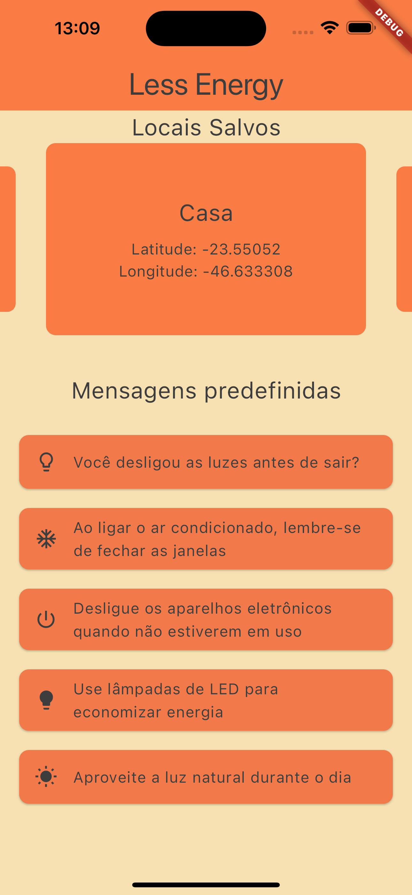
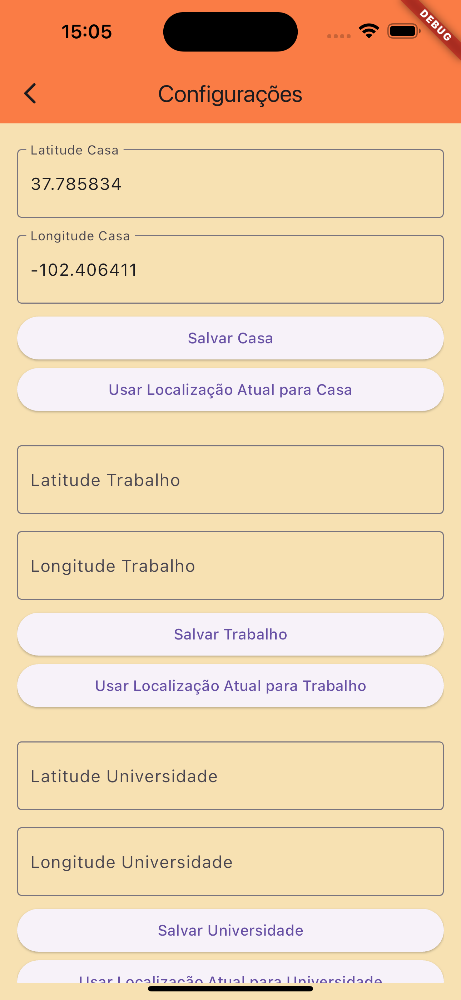
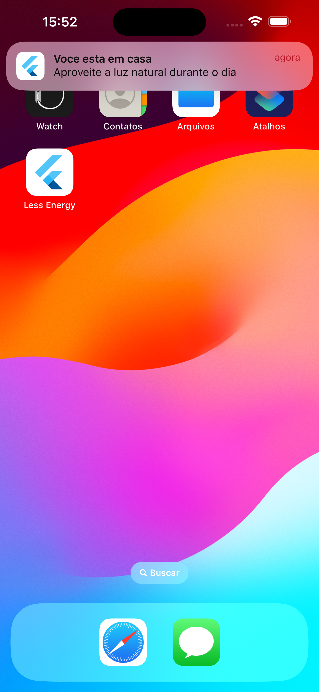
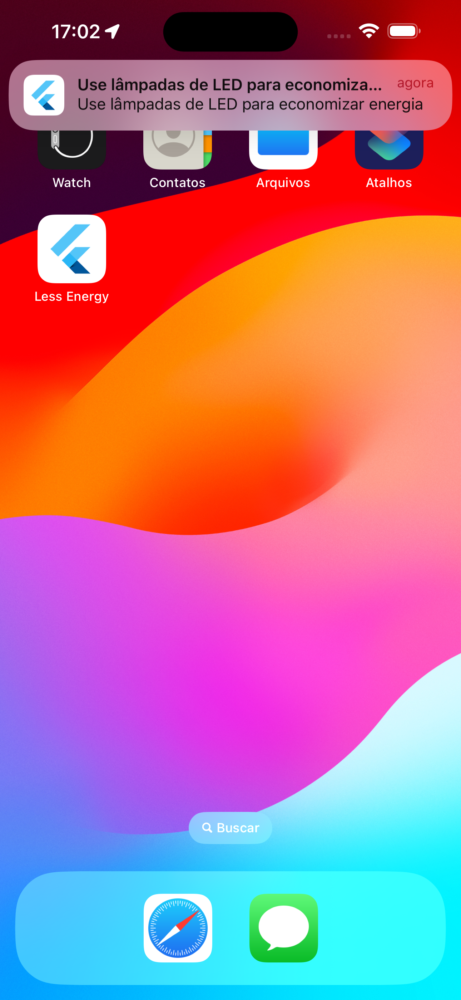

# Less Energy - Aplicação para envio de notificações de economia de energia com base na localização do usuário

## Descrição

O Less Energy ajuda pessoas conscientes a reduzirem seu impacto ambiental com notificações personalizadas de acordo com a sua localização. Quer você esteja em casa, no trabalho, ou em qualquer lugar, o app sugere ações sustentáveis para economizar energia, reduzindo o desperdício e protegendo o meio ambiente. Com uma abordagem prática e personalizada, tornamos fácil e acessível adotar práticas ecológicas em seu dia a dia.

## Funcionalidades

- Envio de notificações personalizadas com base na localização do usuário.
- Sugestões de ações sustentáveis para economizar energia.
- Monitoramento contínuo da localização em segundo plano.
- Interface amigável e fácil de usar.

## Ferramentas Utilizadas

- **Flutter**: Framework para desenvolvimento de aplicativos móveis.
- **GetX**: Gerenciamento de estado e navegação.
- **Shared Preferences**: Armazenamento local de dados.
- **Geolocator**: Obtenção de localização do usuário.
- **Flutter Local Notifications**: Envio de notificações locais.

## Capturas de Tela do Projeto

<p align="center">
  
  
  
  
</p>


## Instalação

1. Clone o repositório:
   ```sh
   git clone https://github.com/seu-usuario/less-energy.git
   ```
2. Entre no diretório do projeto:
   ```bash
   cd less_energy_app
   ```

3. Instalar dependências
   ```bash
   flutter pub get
   ```

4. Executar o aplicativo
   ```bash
   flutter run
